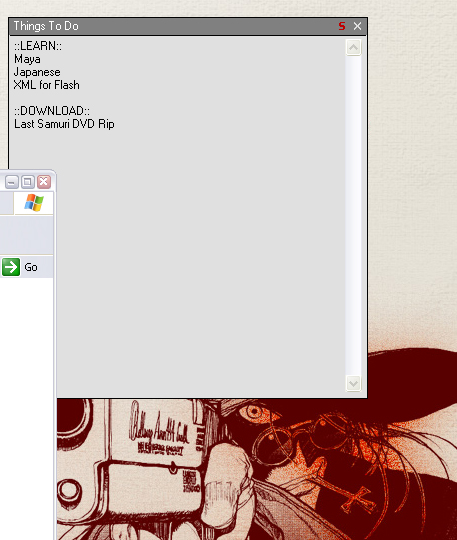



## Always Behind other windows example

### Description

Have a window on your desktop that is glued to the desktop! Drag it BEHIND other windows!!!

Never seen before, very useful for desktop oriented applications, for example.
 
### More Info
 
Since VB automatically sets the focus on your window when you click it, so either program your window using API calls so it won't set the focus or else the window will appear infront of the other windows for a split second. It may or may not be noticable.

             |
---                |---
**Submitted On**   |2004-02-18 17:37:08
**By**             |[Mark Anthony Entingh](https://github.com/Planet-Source-Code/PSCIndex/blob/master/ByAuthor/mark-anthony-entingh.md)
**Level**          |Advanced
**User Rating**    |5.0 (10 globes from 2 users)
**Compatibility**  |VB 3\.0, VB 4\.0 \(32\-bit\), VB 5\.0, VB 6\.0
**Category**       |[Windows API Call/ Explanation](https://github.com/Planet-Source-Code/PSCIndex/blob/master/ByCategory/windows-api-call-explanation__1-39.md)
**World**          |[Visual Basic](https://github.com/Planet-Source-Code/PSCIndex/blob/master/ByWorld/visual-basic.md)
**Archive File**   |[Always\_Beh1710552182004\.zip](https://github.com/Planet-Source-Code/mark-anthony-entingh-always-behind-other-windows-example__1-51852/archive/master.zip)

